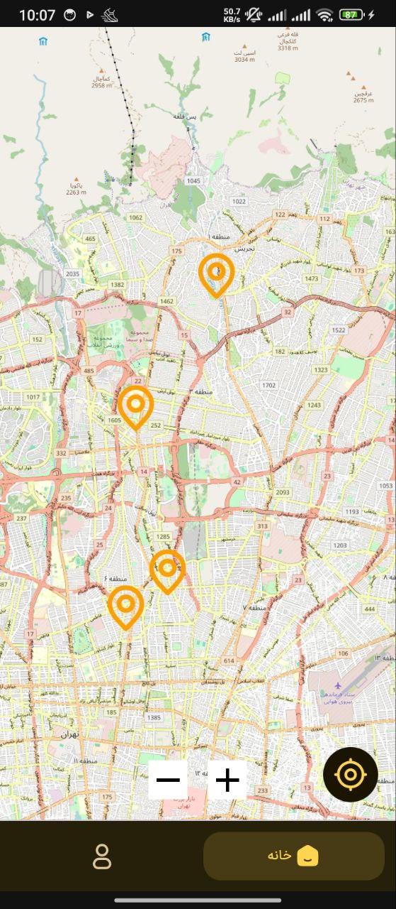

## About Heatyab – هیئت‌یاب

Heatyab is a smart Android application that helps you instantly discover nearby religious gatherings (Hey'at) and mourning ceremonies based on your current location.

With real-time location tracking, the app shows you the closest active or upcoming Hey'ats along with complete details:
- Date and time of the ceremony
- Madah (eulogist/reciter) and speaker names
- Full address and navigation
- Organizer information
- Type of ceremony and additional notes

## Download Application (APK)

## Tech Stack & Libraries
| Category                  | Technology / Library                                 |
|---------------------------|-------------------------------------------------------|
| Language                  | 100% Kotlin                                           |
| Architecture              | Clean Architecture + MVI (Model-View-Intent)          |
| UI Framework              | Jetpack Compose                                       |
| Dependency Injection      | Hilt (Dagger)                                         |
| State Management          | StateFlow + SharedFlow                                |
| Concurrency               | Kotlin Coroutines + Flow                              |
| Local Database            | Room                                                  |
| Networking                | Retrofit + OkHttp                                     |
| Mocking & Testing         | OkHttp MockWebServer + MockInterceptor                |
| Navigation                | Jetpack Navigation Component (Compose)                |

|||
|---|---|
